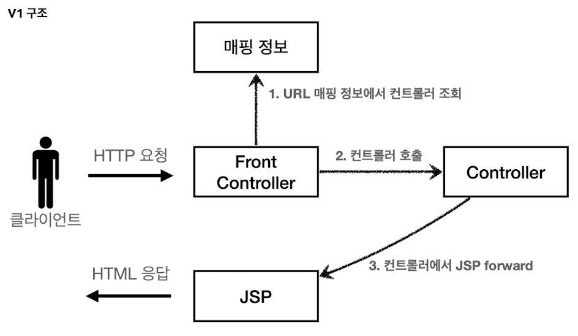
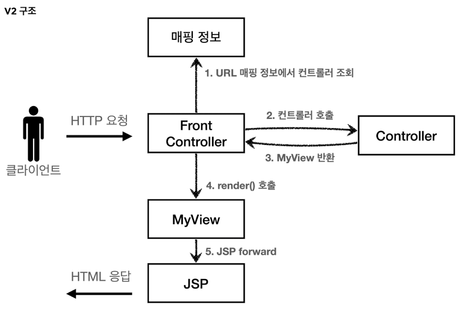
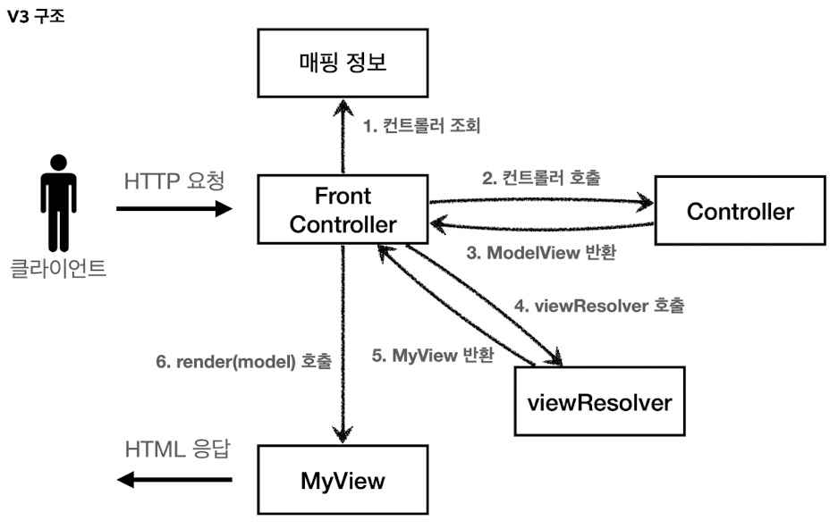
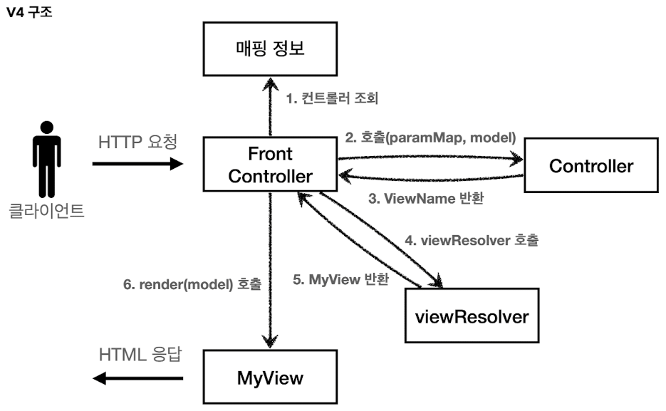
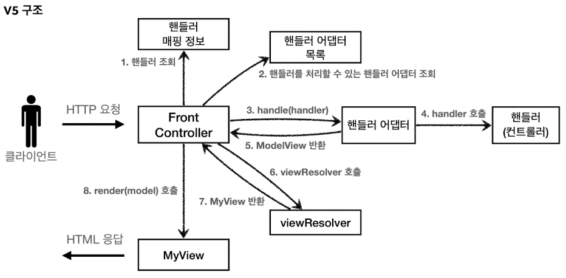

# V1 - FrontController 도입


- FrontController 패턴
    - 프론트 컨트롤러 서블릿 하나로 클라이언트의 요청을 받음
    - 프론트 컨트롤러가 요청에 맞는 컨트롤러를 찾아서 호출
    - 공통 처리 가능
    - 프론트 컨트롤러를 제외한 나머지 컨트롤러는 서블릿을 사용하지 않아도 됨

# V2 - View 분리


- MyView
    - 모든 컨트롤러에서 뷰로 이동하는 소스코드가 중복 됨
        ```java
        String viewPath = "/WEB-INF/views/new-form.jsp";
        RequestDispatcher dispatcher = request.getRequestDispatcher(viewPath);
        dispatcher.forward(request, response);
        ```

# V3 - Model 추가


- ModelView
    - 서블릿 종속성 제거
        - request 객체대신 별도의 Model 객체 사용
- viewResolver
    - 뷰 이름 중복 제거
        - 뷰의 논리 이름 활용을 통해 중복 제거

# V4 - 실용성


- v3와 유사한 아키텍처이지만, 개발과정의 편리함 고려
    - 컨트롤러에서 model을 직접 생성하지 않아도 됨

# V5 - 유연성


- 어댑터 패턴
    - v3, v4의 호환성 도입
    - 핸들러 어댑터: 적절한 핸들러의 호출
        ```java
        public interface MyHandlerAdapter {

            boolean supports(Object handler);

            ModelView handle(HttpServletRequest request, HttpServletResponse response, Object handler) throws ServletException, IOException;
        }
        ```
