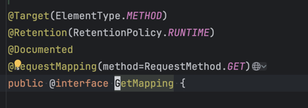
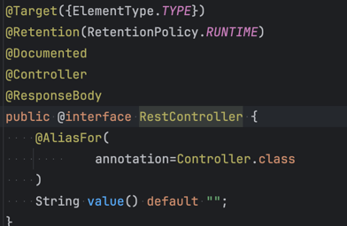
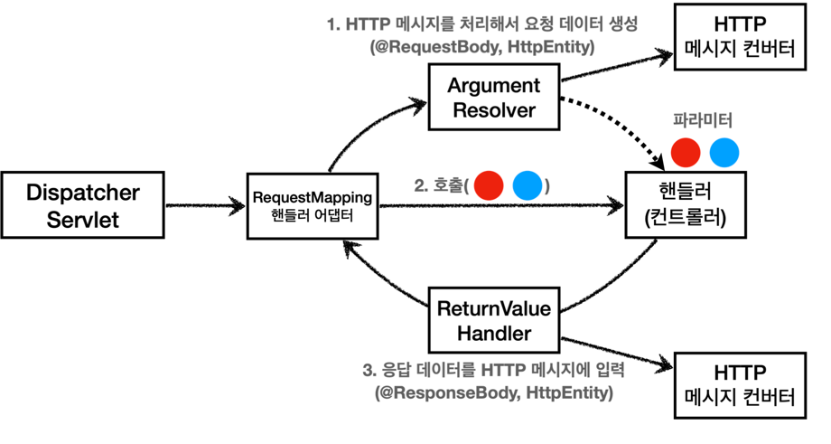
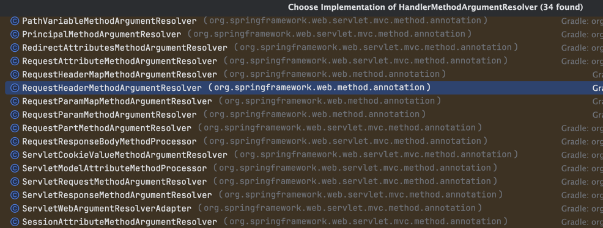

# 6. 기본 기능

## 개요
1. 기본 매핑 방법
2. 상세한 @RequestMapping 사용 방법
3. HTTP 요청 파라미터
4. HTTP 응답 데이터
5. `RequestMappingHandlerAdapter`

## 기본 매핑 방법

스프링 MVC 에서는 특정 인터페이스를 구현할 필요가 없이 애노테이션 기반으로 유연하고 편리한 컨트롤러 기능이 제공 된다.
사용하는 방법은 다음과 같다.

1. `@Controller` 를 클래스에 명시해준다.
   - `@RestController` 애노테이션도 내부에 `@Controller`가 있으니 포함된다.
   - 3.0 이하 버전부터는 `@Component` + `@ReuqestMapping` 를 두개 명시해주면 스프링 컨트롤로 인식했지만 3.0 부터는 오직 `@Controller`만 인식이 된다.
2. 매핑할 메소드에 `@RequestMapping` 을 명시한다.

```java
@RestsController
public class HelloController {

    @RequestMapping("/hello")
    public String hello() {
        return "hello";
    }
}
```

### @RequestMapping
`@RequestMapping` 는 요청에 대한 URL, HTTP 메소드, 요청 매개변수와 같은 다양한 매핑방법을 제공한다.
기본 적인 사용 방법은 위에 설명한대로 `@Controller` 가 적용된 클래스에 메서드에 `@RequestMaping` 을 적용시키면 된다.
아래와 같이 적용시키면 `/hello` URL 요청에 대해 응답을 한다.

```java
@RequestMapping("/hello")
public String hello() {
  return "hello";
}
```

`@Controller` 가 적용된 Class 레벨에 적용시키면 하위 매핑들에 공유 매핑을 적용시킬 수 있다.

```java
@RestsController
@RequestMappoing("/hello")
public class HelloController {

  @RequestMapping("/bye")
  public String bye() {
    return "bye";
  }
}
```

위와 같이 적용 시키면 `/hello/bye` 를 요청해야 bye 매핑이 실행된다.


배열로도 여러 요청 URL을 지정할 수 있다.

```java
@RequestMapping({"/hello", "/hi"})
public String hello() {
  return "hello";
}
```

### 경로 변수 `@PathVariable`
HTTP API에서 자원과 자원의 대한 아이디를 표현할 때 사용하는 경로변수를 사용할 수 있다. `@RequestMapping`는 경로 변수를 가져올 수 있는 기능이 제공된다.

경로 변수는 `"/owners/{ownerId}/pets/{petId}"` 의 `{ownerId}`, `petId` 와 같이 {} 사이 경로변수를 지정할 수 있다
위와 같이 매핑 애노테이션의 value의 URL의 지정할 수 있고 컨트롤러의 파라미터에 @PathVariable 를 명시해주면 된다.

URI 변수는 자동으로 단순 유형( int, long, Date등...)이 기본적으로 지원되지만 단순 타입이 아니면 `TypeMismatchException`가 발생하니 참고하자

```java
@RequestMapping(value = "/owners/{ownerId}/pets/{petId}")
public Pet findPet(@PathVariable("ownerId") Long ownerId, @PathVariable("petId") Long petId) {
  // ...
}
```

URI의 변수를 명시적으로 (`@PathVariable("ownerId")`) 지정할 수 있지만 다음과 같이 생략할 수 있다.

```java
@RequestMapping("/owners/{ownerId}/pets/{petId}")
public Pet findPet(@PathVariable Long ownerId, @PathVariable Long petId) {
  // ...
}
```

생략을 하려면 `@RequestMapping` 의 경로변수의 이름과 파라미터의 이름이 일치 해야 한다.

그 외 다양한 패턴및 컨텐츠 협상및 여러가지 기능을 제공하니 필요시 스프링 공식문서를 보고 참고하자
https://docs.spring.io/spring-framework/reference/web/webmvc/mvc-controller/ann-requestmapping.html


### HTTP 메소드
`@RequestMapping("/hello/", method = RequestMethod.GET)` 와 같이 HTTP 메소드를 지정할 수 있다, 이것도 배열로도 다중 설정이 가능하다. 
만약 해당 URL은 없지만 메소드가 존재하지 않으면 `405 Method Not Allowed` 를 응답한다.

또한 `@RequestMapping` 에 메소드를 지정하는 방법보다는 HTTP 축약한 편의 애노테이션을 제공있다. 이 애노테이션들을 사용하는게 더 직관적이다.
  - @GetMapping
  - @PostMapping
  - @PutMapping
  - @DeleteMapping
  - @PatchMapping

참고로 이런 메소드 편의 애노테이션들은 내부에 `@RequestMapping`가 적용 되어있다.



  
## HTTP 요청 파라미터

`@RequestMapping` 적용된 컨트롤러에서는 HTTP 요청에 대해서 편리하게 사용하게 해주는 파라미터들을 제공한다.

### `@RequestParam`

`@RequestParam` 을 사용하면 요청 파라미터 (쿼리 파라미터, HTML Form) 에 대한 값을 매핑 메서드 인수에 넣을 수 있다.

다음과 같이 사용할 수 있다.

```java
@GetMapping("/members")
public Member getMember(@RequestParam("age") Integer age, @RequestParam("name") String name) {
  ...
}
```

HTTP 요청을 다음과 같이 파라미터랑 같이 보냈을 경우 `GET /mebers?age=6&name=seungho`
다음과 같이 값이 제대로 들어오는걸 확인 할 수 있다.


다음은 쿼리 파라미터 말고 form 양식으로 POST 요청해보자

```java
@PostMapping("/members")
public Member saveMember(@RequestParam("age") Integer age, @RequestParam("name") String name) {
  ...
}
```

```http request
POST http://localhost:8080/members
Content-Type: application/x-www-form-urlencoded

name=seunglo&age=6
```

정상적으로 들어온 것을 확인할 수 있다.


HTTP 파라미터 이름이 변수 이름과 같으면 `@RequestParam(name="xx")` 생략이 가능하고
애노테이션 자체도 생략할 수 있다.

> 스프링 부트 3.2부터 자바 컴파일러에 -parameters 옵션을 넣어주어야 애노테이션에 적는 이름을 생략할 수 있다. 영한님께서는 애노테이션 값을 명시하는 것을 권장하신다.

```java
@GetMapping("/members")
public Member getMember(@RequestParam Integer age, @RequestParam String name) {
  ...
}

@GetMapping("/members")
public Member getMember(Integer age, String name) {
  ...
}
```

### `@MoedelAttribute`
`@MoedelAttribute` 는 요청 파라미터에 대해 `@RequestParam` 과 다르게 하나의 값이 아닌 **객체로 받을 수 있다.**

```java

 @Data
 public class Member {
     private String name;
     private int age;
 }

@GetMapping("/members")
public Member getMember(@ModelAttribute Member member) {
  ...
}
```

HTTP 요청을 다음과 같이 파라미터랑 같이 보냈을 경우 `GET /mebers?age=6&name=seungho`
다음과 같이 Member 인스턴스로 값이 제대로 들어오는걸 확인 할 수 있다.


`@RequestParam` 과 마찬가지로 생략이 가능하다.

```java
@GetMapping("/members")
public Member getMember(Member member) {
  ...
}
```

### `@RequestBody`
`@RequestBody` 를 사용하면 HTTP 메시지 바디 정보를 편리하게 조회할 수 있다.
`@RequestBody` 가 있으면 컨트롤러가 실행전 HTTP 본문에 있는 내용과 HTTP 헤더의 Content-Type 을 보고 적절한 타입으로 변환한다.

```java
@PostMapping("/members")
public Member saveMember(@RequestBody Member member) {
  ...
}
```

```http request
POST http://localhost:8080/members
Content-Type: application/json

{
  "name": "seungho",
  "age": 6
}
```

## HTTP 응답

스프링(서버)에서 응답 데이터를 만드는 방법은 크게 3가지이다.
- 정적 리소스
  - 예) 웹 브라우저에 정적인 HTML, css, js를 제공할 때는, **정적 리소스**를 사용한다.
- 뷰 템플릿 사용
  - 예) 웹 브라우저에 동적인 HTML을 제공할 때는 뷰 템플릿을 사용한다.
- HTTP 메시지 사용
  - HTTP API를 제공하는 경우에는 HTML이 아니라 데이터를 전달해야 하므로, HTTP 메시지 바디에 JSON 같은 형식으로 데이터를 실어 보낸다.
  
### 정적 리소스, 뷰 템플릿


### `ResponseEntity`

### `@ResponseBody`
`@ResponseBody` 를 사용하면 응답 결과를 HTTP 메시지 바디에 직접 담아서 전달할 수 있다.



`@RestController` 를 사용하면 매핑 메소드에 `@ResponseBody` 에 적용시키지 않고 사용할 수 있으니 참고하자

```java
@RestController
public class HelloController {

    @PostMapping("/members")
    public Member getMember() {
        Member member = new Member();
        member.setAge(6);
        member.setName("seungho");
        return member;
    }
}
```

다음과 같이 요청에 대한 json 값으로 응답을 확인 할 수 있다.

```http request
HTTP/1.1 200 
content-Type: application/json

{
  "name": "seungho",
  "age": 6
}
```

## RequestMappingHandlerAdapter 구조



전체적인 프로세스는 다음과 같다.

1. 핸드러 어댑터가 호출 된다.
2. 핸들러 실행 전  해당 핸들러 메소드에 있는 `ArgumentResolver`가 인자(argument)의 값을 바인딩 한다.
   - `ArgumentResolver`는 요청 인자가 `@RequestBody` 또는 `HttpEntity` 가 있으면 **HTTP 메시지 컨버터를 통해 body를 객체로 변환 시킨다.**
3. 핸들러고 실행 후 `ReturnValueHandler` 를 통해 반환 값에 대해 처리 한다.
   - 핸들러에 `@ResponsBody` 혹은 반환 타입이 `HttpEntity` 면 해당 값을 처리하는 `ReturnValueHandler` 에서는 **HTTP 메시지 컨버터를 통해 객체를 해당 컨텐츠에 맞는 Http Body로 변환 시킨다**

### ArgumentResolver

애노테이션 기반의 컨트롤러는 매우 다양한 파라미터를 사용할 수 있었다.
`HttpServletRequest` , `Model` 은 물론이고, `@RequestParam` , `@ModelAttribute` 같은 애노테이션 그리고
`@RequestBody` , `HttpEntity` 같은 HTTP 메시지를 처리하는 부분까지 매우 큰 유연함을 보여주었다. 이렇게 파라미터를 유연하게 처리할 수 있는 이유가 바로 `ArgumentResolver` 덕분이다.

위의 동작 방식에서 설명했던 것처럼 `ArgumentResolver`는 다음과 같은 인터페이스를 제공한다.
```java
public interface HandlerMethodArgumentResolver {

	boolean supportsParameter(MethodParameter parameter);

	@Nullable
	Object resolveArgument(MethodParameter parameter, @Nullable ModelAndViewContainer mavContainer,
			NativeWebRequest webRequest, @Nullable WebDataBinderFactory binderFactory) throws Exception;

}

```



인터페이스를 확장해 스프링이 제공하는 말고 커스텀  `ArgumentResolver` 를 만들 수도 있다.