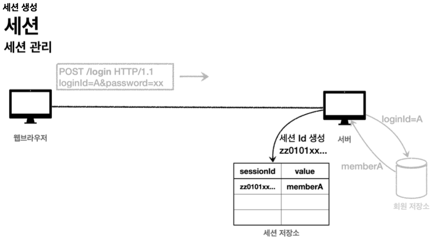

# 로그인 처리1 - 쿠키, 세션

## 패키지 구조 설계
- hello.login
    - domain
        - item
        - member
        - login
    - web
        - item
        - member
        - login

domain: 화면, UI, public Member login(String loginId, String password) {
         return memberRepository.findByLoginId(loginId)
                 .filter(m -> m.getPassword().equals(password))
                 .orElse(null);
}기술 인프라 등등의 영역은 제외한 시스템이 구현해야 하는 핵심 비즈니스 업무 영역

## 로그인 기능 구현

LoginService
```java
public Member login(String loginId, String password) {
    return memberRepository.findByLoginId(loginId)
            .filter(m -> m.getPassword().equals(password))
            .orElse(null);
}
```

## 로그인 처리 - 쿠키 활용
- 쿼리 파라미터를 계속 유지하면서 보내는 것은 매우 어렵고 번거로운 작업이기에 쿠키를 활용

- 동작 방식
    


- 종류
    - 영속 쿠키: 만료 날짜를 입력하면 해당 날짜까지 유지
    - 세션 쿠키: 만료 날짜를 생략하면 브라우저 종료 시 까지만 유지

- 쿠키 생성
    ```java
    // 쿠키에 시간 정보를 주지 않으면 세션 쿠키
    Cookie idCookie = new Cookie("memberId", String.valueOf(loginMember.getId()));
    response.addCookie(idCookie);
    ```
- 쿠키 조회
    ```java
    @GetMapping("/")
    public String homeLogin(
        @CookieValue(name = "memberId", required = false) Long memberId,
        Model model) {
            ...
        }
    ```
- 쿠키 만료
    ```java
    String cookieName = "memberId"
    Cookie cookie = new Cookie(cookieName, null);
    cookie.setMaxAge(0);
    response.addCookie(cookie);
    ```

- 보안 문제
    - 쿠키 값은 임의로 변경할 수 있음
    - 쿠키에 보관된 정보를 훔쳐갈 수 있음
    - 해커가 쿠키를 한 번 훔쳐가면 평생 사용할 수 있음
- 대안
    - 쿠키에 중요한 값 노출 X
    - 예측 불가능한 임의의 토큰 사용
    - 서버 내에서 토큰과 사용자 id를 매핑해서 인식 및 관리

## 로그인 처리 - 세션 활용
- 앞선 살펴 본 쿠키의 보안 문제를 해결하고 대안점 반영하는 방법

- 동작 방식
    - 로그인
        
    - 세션 생성
        
    - 세션id를 응답 쿠키로 전달
           
    - 로그인 이후 접근에 세션id 포함
        

### 직접 만든 세션 적용
- 세션 생성
    ```java
    String sessionId = UUID.randomUUID().toString(); sessionStore.put(sessionId, value);
    Cookie mySessionCookie = new Cookie(SESSION_COOKIE_NAME, sessionId);
    response.addCookie(mySessionCookie)
    ```

- HttpServletRequest에서 쿠키 값 찾기
    ```java
    //findCookie()
    if (request.getCookies() == null) {
        return null;
    }
    return Arrays.stream(request.getCookies())
                .filter(cookie -> cookie.getName().equals(cookieName))
                .findAny()
                .orElse(null);
    ```

- 세션 조회
    ```java
    Cookie sessionCookie = findCookie(request, SESSION_COOKIE_NAME);
    if (sessionCookie == null) {
        return null;
    }
    return sessionStore.get(sessionCookie.getValue());
    ```

- 세션 만료
    ```java
    Cookie sessionCookie = findCookie(request, SESSION_COOKIE_NAME);
    if (sessionCookie != null) {
        sessionStore.remove(sessionCookie.getValue());
    }
    ```

### Servlet Http Session
- HttpSession
    - 앞서 직접 만든 세션과 유사한 방식으로 동작
    - 쿠키 이름으로 JSESSIONID 사용

- 세션 생성
    - request.getSession()
        - true
            - 세션이 있으면 기존 세션을 반환
            - 세션이 없으면 새로운 세션을 생성해서 반환

        - false
            - 세션이 있으면 기존 세션을 반환
            - 세션이 없으면 새로운 세션을 생성 X,  null 반환
- 세션에 보관
    ```java
    HttpSession session = request.getSession();
    session.setAttribute(SessionConst.LOGIN_MEMBER, loginMember);
    ```

- 세션 제거
    ```java
    HttpSession session = request.getSession(false);
    if (session != null) {
        session.invalidate();
    }
    ```

    ```properties
    server.servlet.session.timeout=60 //60초, 기본은 1800(30분)
    ```

- @SessionAttribute
    - 세션 생성 X 
    ```java
    @GetMapping("/")
    public String homeLoginV3Spring(
            @SessionAttribute(name = SessionConst.LOGIN_MEMBER, required = false) Member loginMember,
            Model model) {}
    ```
