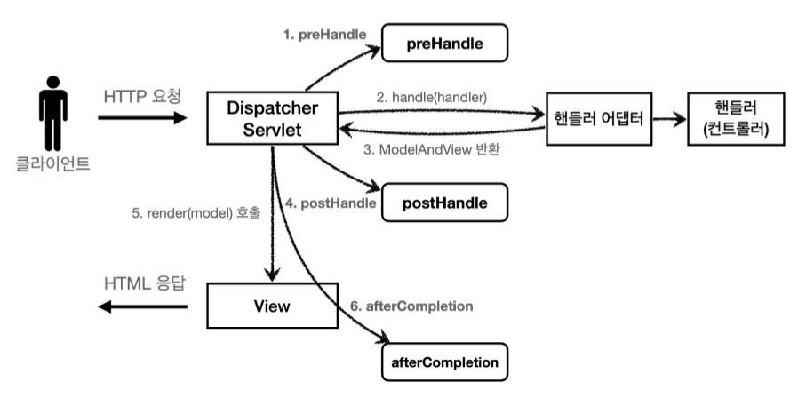

# 로그인 처리2 - 필터, 인터셉터

- 공통 관심 사항
    - 로그인 한 사용자만 본인의 정보에만 접근할 수 있어야 함
    - 애플리케이션 여러 로직에서 공통으로 관심이 있는 것
    - AOP로 해결할 수 있음
    - 웹과 관련된 공통 관심사는 서블릿 필터, 스프링 인터셉터 활용
    
## 서블릿 필터
- 필터 흐름
    - HTTP 요청 -> WAS -> 필터 -> 서블릿 -> 컨트롤러

- 필터 제한
    - 로그인 사용자: HTTP 요청 -> WAS -> 필터 -> 서블릿 -> 컨트롤러
    -  비 로그인 사용자: HTTP 요청 -> WAS -> 필터(적절하지 않은 요청이라 판단, 서블릿 호출X)

- 필터 체인
    - HTTP 요청 -> WAS -> 필터1 -> 필터2 -> 필터3 -> 서블릿 -> 컨트롤러

- 필터 인터페이스
    ``` java
    public interface Filter {
        public default void init(FilterConfig filterConfig) throws ServletException{}
        public void doFilter(
            ServletRequest request, 
            ServletResponse response,
            FilterChain chain) throws IOException, ServletException {}
        public default void destroy() {}
    }
    ```
    - init(): 필터 초기화 메서드, 서블릿 컨테이너가 생성될 때 호출
    - doFilter(): 고객의 요청이 올 때 마다 해당 메서드가 호출. 필터의 로직을 구현
    - destroy(): 필터 종료 메서드, 서블릿 컨테이너가 종료될 때 호출

- 필터 구현
    ```java
    public class LogFilter implements Filter {
        @Override
        public void init(FilterConfig filterConfig) throws ServletException {
            log.info("log filter init");
        }

        @Override
        public void doFilter(ServletRequest request, ServletResponse response, FilterChain chain) throws IOException, ServletException {

            HttpServletRequest httpRequest = (HttpServletRequest) request;
            String requestURI = httpRequest.getRequestURI();
            String uuid = UUID.randomUUID().toString();
            try {
                 log.info("REQUEST  [{}][{}]", uuid, requestURI);
                chain.doFilter(request, response);
            } catch (Exception e) {
                 throw e;
            } finally {
             log.info("RESPONSE [{}][{}]", uuid, requestURI);
            }
        }

        @Override
        public void destroy() {
            log.info("log filter destroy");
        }
    ```

- 필터 설정
    ```java
    @Configuration
    public class WebConfig {
    
        @Bean
        public FilterRegistrationBean logFilter() {
        FilterRegistrationBean<Filter> filterRegistrationBean = new FilterRegistrationBean<>();
        filterRegistrationBean.setFilter(new LogFilter());
        filterRegistrationBean.setOrder(1);
        filterRegistrationBean.addUrlPatterns("/*");
        return filterRegistrationBean;
    }
    ```

## 스프링 인터셉터
- 스프링 인터셉터 흐름
    - HTTP 요청 -> WAS -> 필터 -> 서블릿 -> 스프링 인터셉터 -> 컨트롤러

- 스프링 인터셉터 제한
    - 로그인 사용자: HTTP 요청 -> WAS -> 필터 -> 서블릿 -> 스프링 인터셉터 -> 컨트롤러
    - 비 로그인 사용자: HTTP 요청 -> WAS -> 필터 -> 서블릿 -> 스프링 인터셉터(적절하지 않은 요청이라 판단, 컨트롤러 호출 X) 

- 스프링 인터셉터 체인
    - HTTP 요청 -> WAS -> 필터 -> 서블릿 -> 인터셉터1 -> 인터셉터2 -> 컨트롤러

- 스프인 인터셉터 인터페이스
    ```java
    public interface HandlerInterceptor {
        default boolean preHandle(HttpServletRequest request, HttpServletResponse
    response, Object handler) throws Exception {}

        default void postHandle(HttpServletRequest request, HttpServletResponse response, Object handler, @Nullable ModelAndView modelAndView) throws Exception {}

        default void afterCompletion(HttpServletRequest request, HttpServletResponse response, Object handler, @Nullable Exception ex) throws Exception {}
    }
    ```
    - 서블릿 필터의 경우 doFilter() 하만 제공하지만, 인터셉터의 경우 3가지로 세분화
    - 서블릿 필터의 경우 단순히 request, response만 제공하지만, 인터셉터는 컨트롤러 호출 정보, modelAndView 반환 등 응답 정보도 받음


- mvc 구조내에서 호출 흐름

    - 예외 발생 시 postHandle은 호출되지 않고 afterCompletion은 호출

- 인터셉터 구현
    ```java
    public class LogInterceptor implements HandlerInterceptor {

    public static final String LOG_ID = "logId";

    @Override
    public boolean preHandle(HttpServletRequest request, HttpServletResponse response, Object handler) throws Exception {

        String requestURI = request.getRequestURI();
        String uuid = UUID.randomUUID().toString();

        request.setAttribute(LOG_ID, uuid);

        if (handler instanceof HandlerMethod) {
            HandlerMethod hm = (HandlerMethod) handler;
        }

        log.info("REQUEST [{}][{}][{}]", uuid, requestURI, handler);
        return true;
    }

    @Override
    public void postHandle(HttpServletRequest request, HttpServletResponse response, Object handler, ModelAndView modelAndView) throws Exception {
        log.info("postHandle [{}]", modelAndView);
    }

    @Override
    public void afterCompletion(HttpServletRequest request, HttpServletResponse response, Object handler, Exception ex) throws Exception {
        String requestURI = request.getRequestURI();
        String logId = (String) request.getAttribute(LOG_ID);
        log.info("RESPONSE [{}][{}][{}]", logId, requestURI, handler);
        if (ex != null) {
            log.error("afterCompletion error!!", ex);
        }

        }
    }
    ```

- 인터셉터 설정
    ```java
    @Override
    public void addInterceptors(InterceptorRegistry registry) {
        registry.addInterceptor(new LogInterceptor())
                .order(1)
                .addPathPatterns("/**")
                .excludePathPatterns("/css/**", "/*.ico", "/error");
    }
    ```

## ArgumentResolver 활용

- @Login 애노테이션 생성
    ```java
    @Target(ElementType.PARAMETER)
    @Retention(RetentionPolicy.RUNTIME)
    public @interface Login {
    }
    ```

- LoginMemberArgumentResolver 생성
    ```java
    public class LoginMemberArgumentResolver implements HandlerMethodArgumentResolver {

        @Override
        public boolean supportsParameter(MethodParameter parameter) {
            log.info("supportsParameter 실행");

            boolean hasLoginAnnotation = parameter.hasParameterAnnotation(Login.class);
            boolean hasMemberType = Member.class.isAssignableFrom(parameter.getParameterType());

            return hasLoginAnnotation && hasMemberType;
        }

        @Override
        public Object resolveArgument(MethodParameter parameter, ModelAndViewContainer mavContainer, NativeWebRequest webRequest, WebDataBinderFactory binderFactory) throws Exception {

            log.info("resolveArgument 실행");

            HttpServletRequest request = (HttpServletRequest) webRequest.getNativeRequest();
            HttpSession session = request.getSession(false);
            if (session == null) {
                return null;
            }

            return session.getAttribute(SessionConst.LOGIN_MEMBER);
        }
    }
    ```
- 설정
    ```java
    public class WebConfig implements WebMvcConfigurer {

        @Override
        public void addArgumentResolvers(List<HandlerMethodArgumentResolver> resolvers) {
            resolvers.add(new LoginMemberArgumentResolver());
        }
    }
    ```